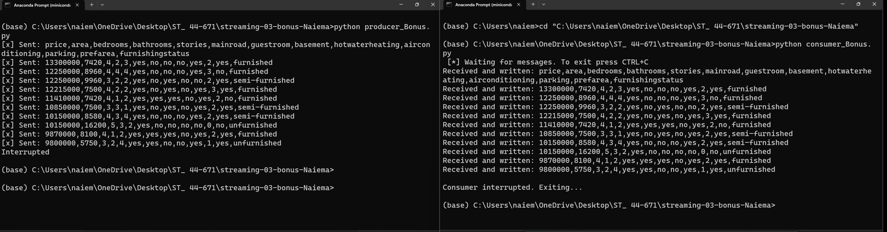

# streaming-03-bonus-Naiema
 Naiema Elsaadi
 Date: August 30, 2023

# Introduction
In this project I created a producer that reads data from my previous Housing Prices CSV files and sends messages to a new queue at intervals of 1-3 seconds. I also created a consumer that reads these messages from this queue and writes the messages to a new file as they are recieved.

## Source Data for csv file:
https://www.kaggle.com/datasets/yasserh/housing-prices-dataset

## The following modules are used in this project:
csv	
random	
signal	
sys	
time	
pika	

## Prerequisites
Git
Python 3.10+ 
VS studio Code 
anaconda prompt (miniconda3)
windows PowerShell

## Reference

- [RabbitMQ Tutorial - Hello, World!](https://www.rabbitmq.com/tutorials/tutorial-one-python.html)
- [Using Python environments in VS Code](https://code.visualstudio.com/docs/python/environments)

## Multiple Terminals

